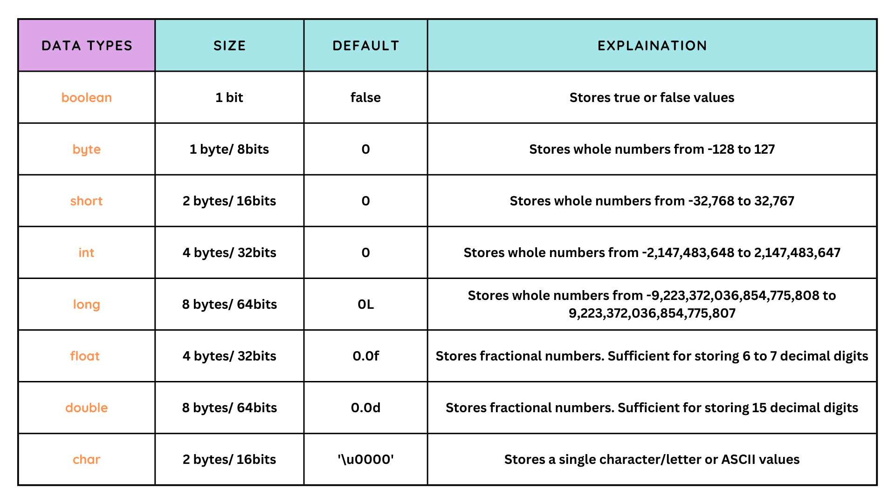
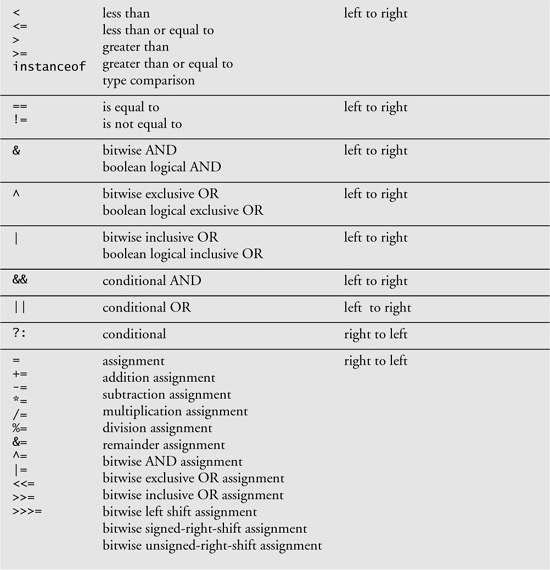
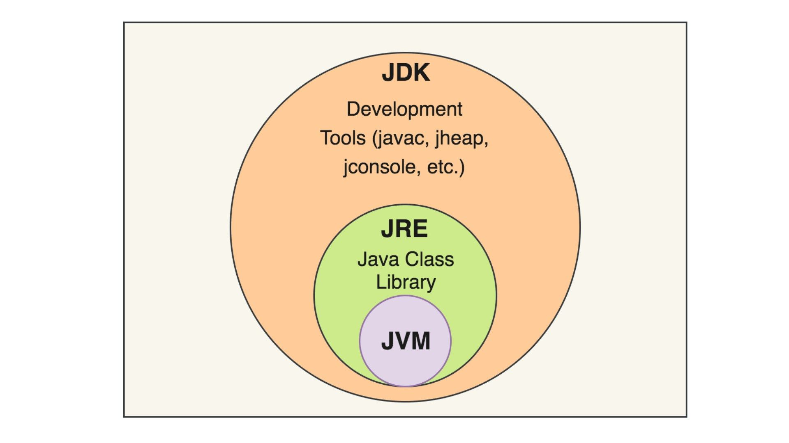

## ☕ My Java Journey
Welcome! This project is all about learning the basics of Java. Below is the "magic recipe" to get your code running! ✨

---
## 🛠️ How to Run the Code
To run a Java program, you have to follow two main steps: Compiling & Running. 🏃💨
#### 1. Compile the Code 🧱
```
javac filename.java
```
- **What happens?** This creates a new file called `name.class` 📄
#### 2. Run the Program 🚀
```
java name
```
---
#### Primitive DataTypes & Size



---
#### Operator Precedence
<p align="center">
  
</p>

---
#### Object-Oriented Programming

<p align="center">
  
</p>

- Every **method** will have their own **Stack**.