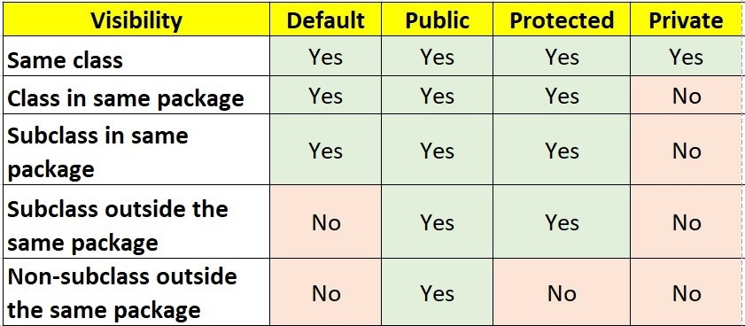
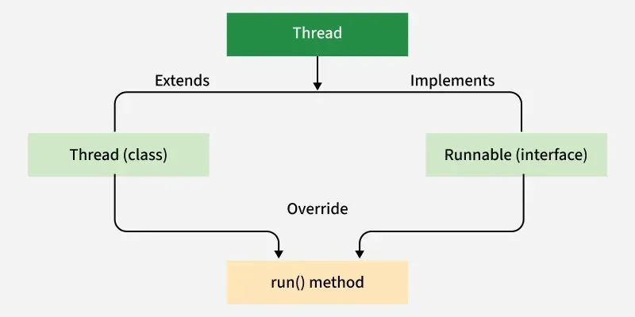
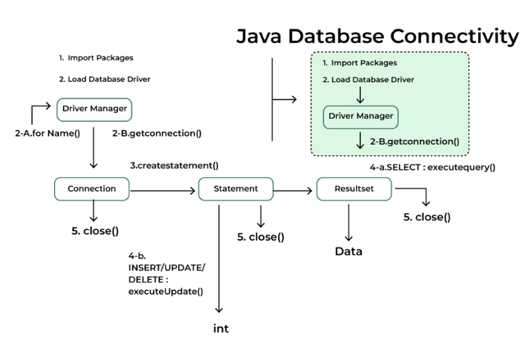
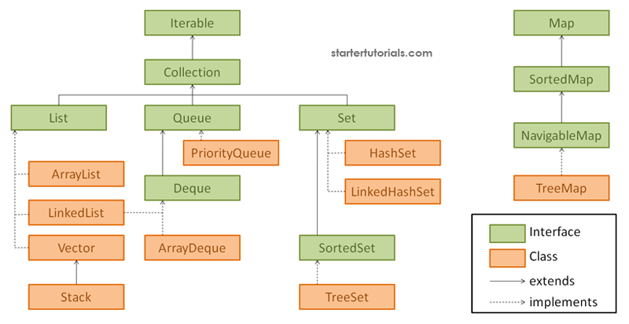

## ☕ My Java Journey
Welcome! This project is all about learning the basics of Java. Below is the "magic recipe" to get your code running! ✨

---
## 🛠️ How to Run the Code
To run a Java program, you have to follow two main steps: Compiling & Running. 🏃💨
#### 1. Compile the Code 🧱
```
javac filename.java
```
- **What happens?** This creates a new file called `name.class` 📄
#### 2. Run the Program 🚀
```
java name
```
---
#### Primitive DataTypes & Size


---
#### Operator Precedence
<p align="center">
  
</p>

---
#### Object-Oriented Programming

<p align="center">
  
</p>

- Every **method** will have their own **Stack**.
---
#### Access Modifiers

<p align="center">
  
</p>

> `default` :  within the `"same package"`

> `protected` : accessible `"within package & subclasses"`

> `private` : only `"within class"` (no-where else)

---
#### Threads
We can create threads in java using two ways

<p align="center">
  
</p>

The `Thread` class is used to create and control threads in Java. Each object of this class represents a single thread of execution.

- Runnable is a  `@FunctionalInterface`

---

#### JDBC (Java Database Connectivity)
1. `import the package (like : java.sql.*)`
2. `Load and Register the driver`
3. `Establish the connection`
4. `Create the statement`
5. `Execute the Query`
6. `Process the result`
7. `close`

<p align="center">
  
</p>

```
import java.sql.*;

public static void main(String[] args){

      Class.forName("com.mysql.cj.jdbc.Driver");
        
        Connection cnt = DriverManager.getConnection("URL","username","password");   // Connection is an interface, getConnection is static method
        
        Statement st = cnt.createStatement();
        ResultSet rs = st.executeQuery("SELECT * FROM STUDENT");

        rs.next(); // shift pointer in the table: row-wise
        rs.getInt(1); //// Gets data from the 1st(Index) column

        st.close();
        cnt.close();

}

```
---

#### Collections Framework

<p align="center">
  
</p>
